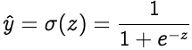

# the math behind networks

## Perceptrons

- A perceptron is a neural network unit (an artificial neuron) that does certain computations to detect features or business intelligence in the input data.
- How this is actually done:
  - given the inputs(the data we are using) and weights(how much the path is valued) as vectors we can take the dot product of these two vectors. This gives us the summation E(this should be a SUM) = x.w
  - then we add a bais, b, to get z = x.w + b. A bais is also known as an offset to help adjust output. We set this value to z for the next step.
  - We take the value, z, and give it to a non-linear activation function. There are multiple functions like this including a binary step function and Sigmoid. A sigmoid function is logistic.

## Learning Algorithm

### Backpropagation

- backward propagation of errors
- loss function: this is used to find out how far from a desired solution we are.
- Mean Squared Error is chosen as loss function for regression problems and cross entropy for classification problems.
- In order to find the best weights and bias for our Perceptron, we need to know how the cost function changes in relation to weights and bias. This is done with the help the gradients (rate of change)

### Optimization

- picking the best values (inputs and weights)
